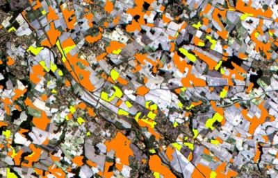

<div align="center">



https://eo-crops.readthedocs.io/en/latest/

🌾 **Python library for crop monitoring using Earth Observations**🛰

</div>

A small python module that brings together the features of SentinelHub, the eo-learn python library and OrfeoToolBox for basic downloading and processing of Earth observation data for crop monitoring. 
SentinelHub account can be sponsored by the [ESA Network-of-Resources (NoR) program](https://nor-discover.cloudeo.group/Service/EDC-Sentinel-Hub/SponsoringWizardPricelist). For weather data, you need to have the [meteoblue API](https://www.meteoblue.com/fr/weather-api/dataset-api/index) 

The documentation is available on this [link](https://eo-crops.readthedocs.io/en/latest/)

# Installation

⚠ On Windows, you need to have C++ using [vs_BuildTools.exe](https://download.visualstudio.microsoft.com/download/pr/07db0e25-01f0-4ac0-946d-e03196d2cc8b/52b77ee7cb5f8e021461456006979d22bbd24d9e2d342f9a5d284567320979e1/vs_BuildTools.exe) installed for making geospatial libraries working ⚠

To install the package, you must first clone the git repository to the desired folder

```bash
git clone git@github.com:j-desloires/eo-crops.git
```

Then, open Anaconda prompt and create the environment from environment.yml

```
cd eo-crops
conda env create -f environment.yml
conda activate eo-crops
pip install .
```


If you want to run a jupyter notebook, you need to install jupyter on the environment. Then, you will be able to select the kernel.

```
pip install notebook
conda install -c anaconda ipykernel -y
python -m ipykernel install --user --name=eo-crops
jupyter notebook
```

# Dependencies

You should have OrfeoToolBox installed (https://www.orfeo-toolbox.org/CookBook/Installation.html) if you would like to apply pansharpening and multitemporal speckle filtering (Quegan). 

# Citation

```
@misc{eocrops_2022,
  title={eo-crops Python package for processing Earth observations for crop monitoring},
  author={Johann Desloires},
  year={2022},
  publisher={Github},
  journal={GitHub repository},
  howpublished={\url{https://github.com/j-desloires/eo-crops}},
}
```
