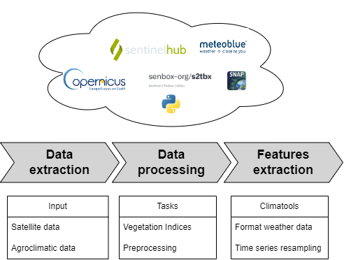

.. eocrops documentation master file, created by
   sphinx-quickstart on Tue Aug  8 10:16:48 2023.
   You can adapt this file completely to your liking, but it should at least
   contain the root `toctree` directive.

Welcome to EOcrops's documentation!
===================================

.. role:: raw-html(raw)
    :format: html

EOCrops gives you an easy way to access products at the field-level from different providers
to download satellite images (Sentinel 1 and Sentinel 2) and agroclimatic data.

EOCrops has the following primary features:

* Download Earth Observation data from SentinelHub  `SentinelHub API <eocrops/examples/Sentinel%20data.ipynb>`_
* Download VHRS data from `VHRS data <eocrops/examples/VHRS%20data.ipynb>`_
* Download weather data from `Meteoblue <eocrops/examples/Weather%20data.ipynb>`_
* Advanced features for vegetation monitoring (vegetation indices, biophysical parameters, spatiotemporal features, ...)
* End-user features (thermal time, feature engineering, ...)

Example
-------

Register a SentinelHub account to one or more providers and copy/paste your API keys, and then
downloading *Sentinel 2 Level-2A* products is as simple as:

.. code-block:: python

   import geopandas as gpd
   from eocrops.input import utils_sh as utils_sh
   from eocrops.input import sentinel2 as sentinel2

   api = ""
   client_id = ""
   client_secret = ""
   config = utils_sh.config_sentinelhub_cred(api, client_id, client_secret)
   # Provide here your planet API key if you have it
   config.planet_key = ""

   # Field boundaries
   shapefile = gpd.read_file('your_path_shp')

   #Meta info
   time_period = ("2020-02-15", "2020-08-15")
   kwargs = dict(polygon=shapefile_input, time_stamp=time_period, config=config)

   # Get your EOPatch for Sentinel-2 !
   patch = sentinel2.workflow_instructions_S2L2A(
       **kwargs,
       path_out=None,  # you can specify here a path to save the EOPatch object
       coverage_predicate=0.5,
       interpolation={"interpolate": True}
   )

Module content
--------------

.. toctree::
   :maxdepth: 4
   :caption: Description:

   markdowns/index

.. toctree::
   :maxdepth: 1
   :caption: Tutorials:

   eocrops/example

.. toctree::
   :maxdepth: 2
   :caption: Source code:

   eocrops/index
   Github Repository <https://github.com/j-desloires/eo-crops>

Indices and tables
------------------

* :ref:`genindex`
* :ref:`modindex`
* :ref:`search`
